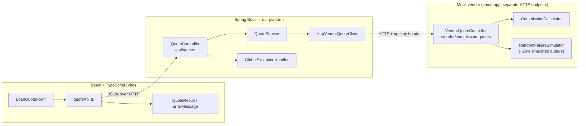
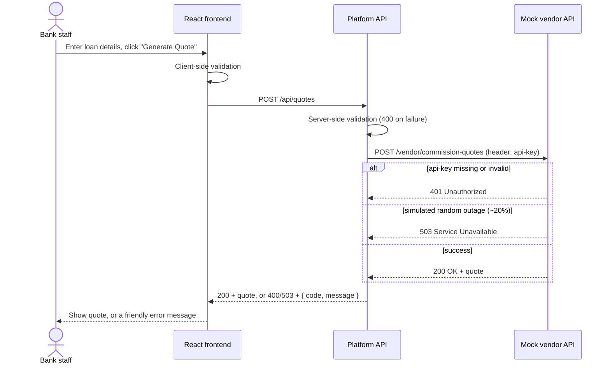

# Commission Quote App

A small full-stack app for a lending platform: a staff member enters loan
details, the backend calls a mock Commission Quote vendor API, and the UI
displays the resulting quote.

## Business overview

A bank's Lending Platform lets staff generate a "Commission
Quote" for a loan application — the fee the bank pays/receives via a broker
or partner arrangement, calculated by an external Vendor system based on the
loan's size, term, and risk profile. That vendor system is still under
construction, so this app is built against a **mock** of it, using an
already-finalised API contract, so the rest of the platform's development
isn't blocked waiting on the real vendor.

**Who uses it.** Lending staff, while processing a loan application, to
quickly see what commission a given set of loan terms would generate before
finalising the deal.

**The workflow.**
1. Staff member enters the loan amount, term (in months), and risk band for
   an application.
2. They click **Generate Quote**.
3. The system sends those details to the Commission Quote vendor and shows
   the resulting quote ID, commission rate, and total commission — or a
   clear error if the request was invalid or the vendor is temporarily
   unavailable (simulated deliberately, since real vendor systems do fail
   intermittently).

## Tech stack

| Layer | Technology |
|---|---|
| Backend | Java 20 (compiles for Java 17+), Spring Boot 3.3.4 (Spring Web, Spring Validation), springdoc-openapi 2.6 (Swagger UI + OpenAPI generation), Gradle 8.2.1 (wrapper committed — no local install needed) |
| Backend tests | JUnit 5, Mockito, Spring `MockRestServiceServer`, Spring Boot Test (`@WebMvcTest` / `@SpringBootTest` + `TestRestTemplate`) |
| Frontend | React 18, TypeScript 5, Vite 5 |
| Frontend tests | Vitest 2, React Testing Library, `@testing-library/user-event` |

## Technical architecture

The mock vendor is a genuinely separate HTTP endpoint (not just a Java method
call) inside the same Spring Boot app, reached over real loopback HTTP. That
means the client's timeout/error handling is exercised for real, and the
vendor's `api-key` requirement is enforced independently of the frontend —
the frontend never sees or sends that key. When the real vendor API is ready,
only `HttpVendorQuoteClient` needs to change; `QuoteService` and
`QuoteController` are unaffected because they depend on the `VendorQuoteClient`
interface.

### Component view



### Request flow (success and failure paths)



## Assumptions

A few details weren't pinned down by the original requirements, so I made
explicit, documented choices:

- **`riskBand` values**: not otherwise specified, so I used `LOW` /
  `MEDIUM` / `HIGH` (see `RiskBand.java` / `types/quote.ts`). A real
  integration would use whatever enum the actual vendor contract defines.
- **Commission rates**: 1.0% / 2.0% / 3.5% for LOW/MEDIUM/HIGH respectively —
  made up for this exercise, not real figures.
- **`api-key` header name**: the requirement was that the vendor "must
  require an `api-key` header", so that's the literal header name used
  (not `X-API-Key` or similar).
- **Backend port 8081, not 8080**: on this machine port 8080 was already
  partially occupied by an unrelated local Jenkins instance, which caused
  intermittent, hard-to-diagnose failures when the backend called itself.
  8081 avoids that class of conflict; see `application.yml`.

## Prerequisites

- Java 17+ (developed and tested with Java 20)
- Node 18+ (developed and tested with Node 25)
- No local Maven/Gradle install needed — the backend ships with the Gradle
  wrapper (`./gradlew`)

## Running it

### Backend (port 8081)

```bash
cd backend
./gradlew bootRun
```

The API is now available at `http://localhost:8081`.

### Frontend (port 5173)

```bash
cd frontend
npm install
npm run dev
```

Open `http://localhost:5173`. The frontend is pre-configured (via `.env`) to
call the backend at `http://localhost:8081`.

### Running the tests

```bash
# Backend: unit + controller + full-stack integration/security tests
cd backend
./gradlew test

# Frontend: component + API client tests
cd frontend
npm test
```

## API contract

**`POST /api/quotes`** (called by the frontend)

Request:
```json
{ "loanAmount": 100000, "loanTermInMonths": 60, "riskBand": "MEDIUM" }
```

Success (200):
```json
{ "quoteId": "Q-7AB2DCA0", "commissionRate": 0.02, "totalCommission": 2000.00 }
```

Error shape (400 / 503 / 500), consistent across all failure modes so the
frontend has one thing to render:
```json
{ "code": "VALIDATION_ERROR", "message": "...", "details": ["loanAmount: ..."] }
```

**`POST /vendor/commission-quotes`** (mock vendor, called only by the backend)
— same request/response contract, plus a required `api-key` header.

The contract above is also documented formally, three ways, so anyone with
repo access can see it without reading the controller code:

- **Interactive** — with the backend running, open
  `http://localhost:8081/swagger-ui.html`.
- **Static OpenAPI file** — [`backend/openapi.yaml`](backend/openapi.yaml),
  generated from the same annotations as the live Swagger UI (regenerate
  after an API change with `curl http://localhost:8081/v3/api-docs.yaml -o
  backend/openapi.yaml` while the backend is running).
- **Postman** — [`backend/postman/`](backend/postman) has a collection
  covering both endpoints (success and every error case below) plus a
  matching local environment. Import both into Postman to try it without
  writing any requests by hand.

## Testing approach

- **Unit**: `CommissionCalculator`, `RandomFailureSimulator`, `QuoteService`,
  `HttpVendorQuoteClient` (via `MockRestServiceServer`), and the vendor
  controller's api-key logic (plain object test, no Spring context needed).
- **Controller slice** (`@WebMvcTest`): validation and error-mapping for
  `/api/quotes` — negative/zero amounts, out-of-range terms, missing/invalid
  risk band, malformed JSON, vendor-unavailable propagation.
- **Full-stack integration** (`@SpringBootTest`, real HTTP): the platform API
  calling the real vendor endpoint over loopback, with the vendor's failure
  rate pinned to 0 (happy path) or 1 (outage path) for determinism, plus a
  dedicated security test proving the vendor endpoint rejects requests with
  a missing/incorrect `api-key` over real HTTP.
- **Frontend**: form validation and submission behaviour (React Testing
  Library), the `quoteApi` client's success/error/network-failure handling
  (mocked `fetch`), and `App`-level integration for loading/success/error
  states.

## Edge cases handled

- Invalid input: empty/negative/zero loan amount, non-integer or
  out-of-range loan term, missing/unrecognised risk band, malformed JSON —
  all rejected with 400 and a specific message, both client-side (before any
  network call) and server-side (defence in depth).
- Vendor timeout or connection failure, vendor 4xx/5xx, and the vendor's
  simulated random outage all surface to the user as the same friendly
  "temporarily unavailable, please try again" message rather than a raw
  stack trace or a hung UI.
- Missing/incorrect `api-key` on the vendor endpoint is rejected (401)
  independently of anything the frontend does.

## Security considerations

- **Constant-time api-key comparison.** The vendor endpoint checks the
  `api-key` header with `MessageDigest.isEqual` on the UTF-8 bytes, not
  `String.equals`. `String.equals` short-circuits on the first mismatched
  character, so with enough samples a network-level timing attack can
  extract the key one character at a time; `MessageDigest.isEqual` always
  compares the full length.
- **The vendor api-key never reaches the frontend.** It's read server-side
  from `VendorProperties` and attached only inside `HttpVendorQuoteClient`;
  the browser has no way to see or exfiltrate it.
- **No internal detail leaks to the client.** `GlobalExceptionHandler`
  translates every failure (validation, auth, vendor outage, unexpected
  exceptions) into the same `{code, message}` shape — no stack traces, no
  vendor error bodies, no exception class names in the response.
- **CORS is scoped narrowly.** Only `/api/**` allows cross-origin requests,
  and only from `http://localhost:5173`. `/vendor/**` allows none - it's
  reachable only from the backend itself.
- **Input is validated at the boundary**, both client-side (fast feedback,
  no wasted round trip) and server-side via Bean Validation (the actual
  enforcement point — the client-side check is a convenience, not a trust
  boundary).
- **Out of scope for this exercise, flagged rather than silently skipped:**
  no authentication/authorization on `/api/quotes` itself (anyone who can
  reach the backend can request a quote — a real deployment would need
  staff auth here), no rate limiting, and the vendor api-key's default
  value lives in `application.yml` rather than a secrets manager (see
  below).

## What I'd do differently for production

- Vendor credentials from a secrets manager, not an env-var default in
  `application.yml`.
- Authentication/authorization on `/api/quotes` (see "Security
  considerations" above) and rate limiting on both endpoints.
- Retry with backoff for transient vendor failures instead of surfacing the
  first error immediately.
- Persist generated quotes (currently stateless/in-memory only).

## AI usage disclosure

In the interest of transparency, this project was built with **Claude**
(Anthropic) as a pair-programming assistant, used heavily throughout. A
concrete breakdown:

- **Scaffolding**: generated the initial project structure for both the
  Spring Boot/Gradle backend and the Vite/React/TypeScript frontend.
- **Implementation**: wrote the first draft of the controllers, the
  vendor HTTP client, DTOs/validation, the global exception handler, and
  the React form/result/error components and API client, from the stated
  requirements.
- **Tests**: generated the JUnit/Mockito/`MockRestServiceServer` backend
  suite (unit, `@WebMvcTest` controller slice, and full-stack
  `@SpringBootTest` integration/security tests) and the
  Vitest/React Testing Library frontend suite.
- **Debugging**: diagnosed a real, non-obvious environment issue found
  while smoke-testing — the backend, calling itself over loopback on port
  8080, was intermittently hitting an unrelated local Jenkins instance
  also bound to that port (visible as unexplained 403 responses carrying a
  Jenkins-specific error body). Claude added temporary diagnostic logging
  to capture the actual response, identified the conflict, then removed
  the diagnostic and moved the app to port 8081.
- **Architecture documentation**: drafted this README's diagrams and
  structure, which I then reviewed and edited.
- **API contract tooling**: added the springdoc-openapi dependency and
  annotations, generated `backend/openapi.yaml` from the running app, and
  wrote the Postman collection/environment under `backend/postman/`.
- **Security pass**: flagged the api-key comparison as timing-unsafe and
  fixed it to use `MessageDigest.isEqual`; wrote the "Security
  considerations" section above.

I reviewed every file, ran the full backend and frontend test suites, and
verified the app manually (success, validation, and vendor-outage paths)
before treating anything as done — the code here is something I understand
and stand behind, not just accepted output.
